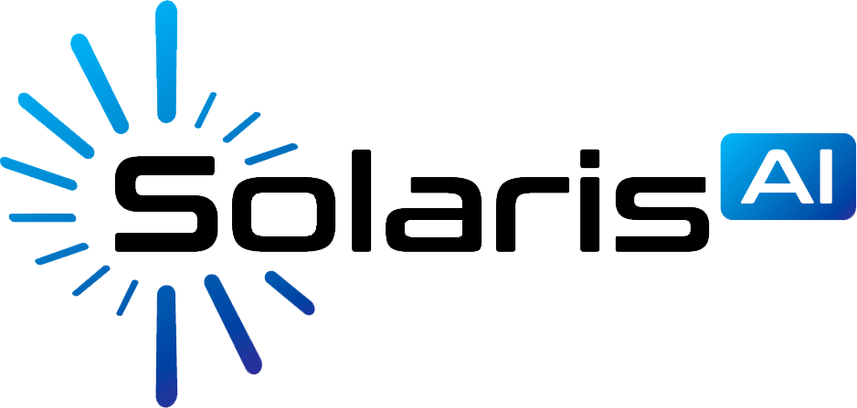

# Alvee Ahnaf Mir

  

## About Me
I am a Software Engineer based in Brisbane, Australia, currently pursuing my Master's in Software Engineering at The University of Queensland. With experience in full-stack development, cloud architecture, and machine learning, I specialize in building scalable systems and innovative solutions.

[GitHub](https://github.com/bardicbyte) | [LinkedIn](https://in/alvee-mir-b11322208) | [Email](mailto:alveaahnaf25@gmail.com)

## Education

  
  

    <h3>Master of Software Engineering (Professional)</h3>
    
<strong>The University of Queensland</strong> • Brisbane, Queensland • 2025

  

  
  

    <h3>Bachelor of Science in Computer Engineering</h3>
    
<strong>American University of Sharjah</strong> • Sharjah, UAE • 2023

  

## Experience

  
  

    <h3>Software Engineer</h3>
    
<strong>SolarisAI</strong> • December 2024 - Present

  

- Architected and implemented scalable AWS cloud infrastructure using IaC principles, achieving 99.9% uptime
- Developed a mission-critical data ingress engine service using Python/Java microservices architecture
- Led frontend modernization initiative by migrating to Next.js React framework, improving page load times by 30%

### Research Assistant (Developer)
**The University of Queensland** • July 2024 - Present • Brisbane

- Developing a scalable Peer-to-Peer Energy Trading Platform using React.js and Node.js
- Implementing containerized architecture with Docker and Kubernetes on UQ Cloud Infrastructure
- Engineered CI/CD pipeline using GitLab with automated testing and Prometheus monitoring

### Junior Software Engineer (Intern)
**Go2Asset** • March 2024 - July 2024 • Brisbane, Queensland

- Developed lightweight flood detection app processing Bureau of Meteorology data
- Implemented fast fourier transform algorithm for real-time flood risk forecasting
- Designed scalable AWS architecture for reliable flood alerts

### Full-Stack Developer (Intern)
**AEBISS Inc.** • May 2022 - August 2022 • Dubai, UAE

- Integrated RESTful APIs for microservice-architected ATS application
- Worked in agile environment delivering features in regular sprints
- Incorporated BERT-based NLP model for efficient resume parsing

## Projects

### BCI-VR Based Rehabilitation System
**GUA Top 7% in the World** • [Project Details](https://www.undergraduateawards.com/winners/highly-commended-2023)

- Pioneered Brain-Computer Interface (BCI) system integrated with VR for motor skill rehabilitation
- Engineered intuitive dashboards with RESTful API integration for progress tracking
- Implemented EEG data acquisition with TensorFlow for movement intention interpretation
- Improved model accuracy by 25% compared to literature review

---
*Last Updated: March 2024*
