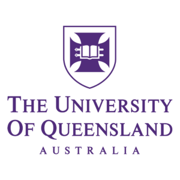

<header class="header">
  <h1>Alvee Ahnaf Mir</h1>
  <nav class="nav-links">
    <a href="#about">About</a>
    <a href="#education">Education</a>
    <a href="#experience">Experience</a>
    <a href="#projects">Projects</a>
    <a href="/blog">Blog</a>
  </nav>
</header>

  

<section id="about">
  <h2>About Me</h2>
  

    
I am a Software Engineer based in Brisbane, Australia, currently pursuing my Master's in Software Engineering at The University of Queensland. With experience in full-stack development, cloud architecture, and machine learning, I specialize in building scalable systems and innovative solutions.

    

      <a href="https://github.com/bardicbyte">GitHub</a>
      <a href="https://in/alvee-mir-b11322208">LinkedIn</a>
      <a href="mailto:alveaahnaf25@gmail.com">Email</a>
    

  

</section>

<section id="education">
  <h2>Education</h2>
  
  

    

      
      

        <h3>Master of Software Engineering (Professional)</h3>
        
<strong>The University of Queensland</strong> • Brisbane, Queensland • 2025

      

    

  

  

    

      
      

        <h3>Bachelor of Science in Computer Engineering</h3>
        
<strong>American University of Sharjah</strong> • Sharjah, UAE • 2023

      

    

  

</section>

<section id="experience">
  <h2>Experience</h2>

  

    

      
      

        <h3>Software Engineer</h3>
        
<strong>SolarisAI</strong> • December 2024 - Present

      

    

    <ul>
      <li>Architected and implemented scalable AWS cloud infrastructure using IaC principles, achieving 99.9% uptime</li>
      <li>Developed a mission-critical data ingress engine service using Python/Java microservices architecture</li>
      <li>Led frontend modernization initiative by migrating to Next.js React framework, improving page load times by 30%</li>
    </ul>
  

  

    

      
      

        <h3>Research Assistant (Developer)</h3>
        
<strong>The University of Queensland</strong> • July 2024 - Present • Brisbane

      

    

    <ul>
      <li>Developing a scalable Peer-to-Peer Energy Trading Platform using React.js and Node.js</li>
      <li>Implementing containerized architecture with Docker and Kubernetes on UQ Cloud Infrastructure</li>
      <li>Engineered CI/CD pipeline using GitLab with automated testing and Prometheus monitoring</li>
    </ul>
  

  

    <h3>Junior Software Engineer (Intern)</h3>
    
<strong>Go2Asset</strong> • March 2024 - July 2024 • Brisbane, Queensland

    <ul>
      <li>Developed lightweight flood detection app processing Bureau of Meteorology data</li>
      <li>Implemented fast fourier transform algorithm for real-time flood risk forecasting</li>
      <li>Designed scalable AWS architecture for reliable flood alerts</li>
    </ul>
  

  

    <h3>Full-Stack Developer (Intern)</h3>
    
<strong>AEBISS Inc.</strong> • May 2022 - August 2022 • Dubai, UAE

    <ul>
      <li>Integrated RESTful APIs for microservice-architected ATS application</li>
      <li>Worked in agile environment delivering features in regular sprints</li>
      <li>Incorporated BERT-based NLP model for efficient resume parsing</li>
    </ul>
  

</section>

<section id="projects">
  <h2>Projects</h2>

  

    <h3>BCI-VR Based Rehabilitation System</h3>
    
<strong>GUA Top 7% in the World</strong> • <a href="https://www.undergraduateawards.com/winners/highly-commended-2023">Project Details</a>

    <ul>
      <li>Pioneered Brain-Computer Interface (BCI) system integrated with VR for motor skill rehabilitation</li>
      <li>Engineered intuitive dashboards with RESTful API integration for progress tracking</li>
      <li>Implemented EEG data acquisition with TensorFlow for movement intention interpretation</li>
      <li>Improved model accuracy by 25% compared to literature review</li>
    </ul>
  

</section>

<footer style="text-align: center; margin-top: 40px; padding: 20px 0; border-top: 1px solid var(--accent-color);">
  
<em>Last Updated: March 2024</em>

</footer>
